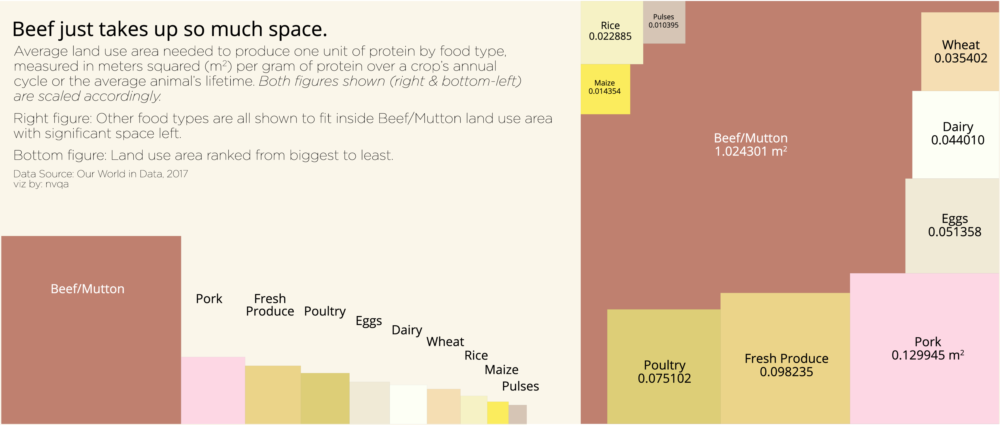
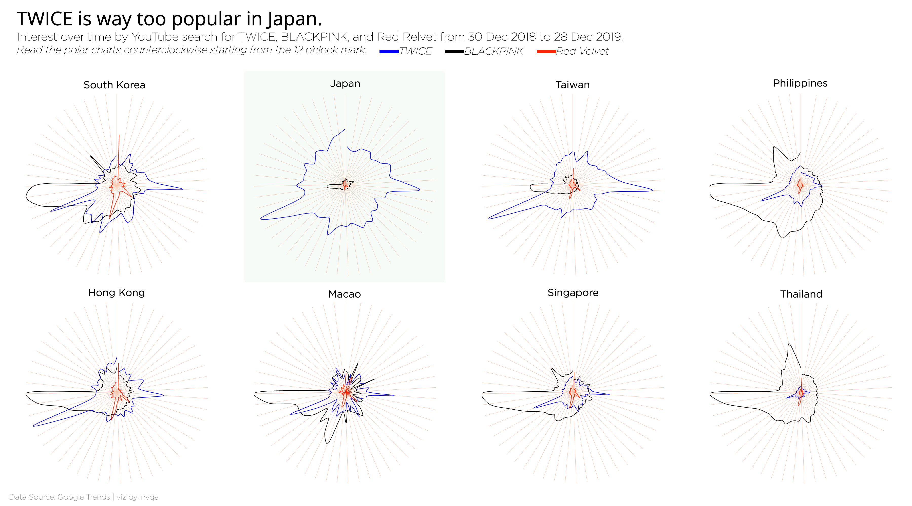
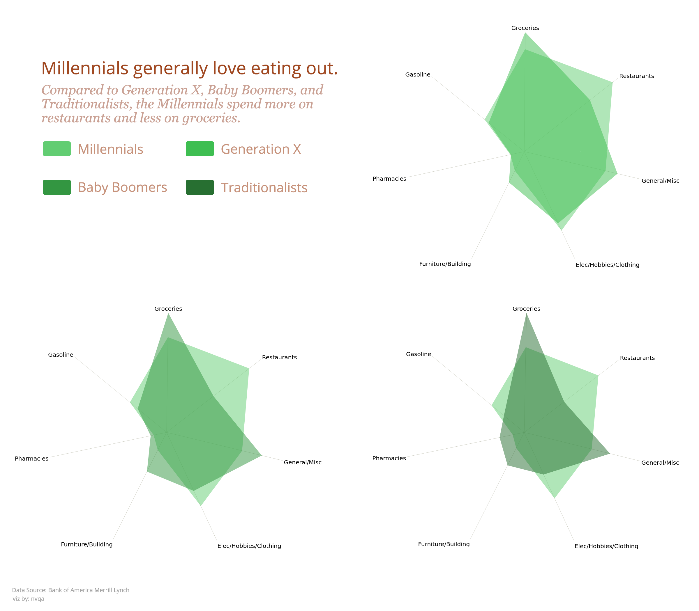
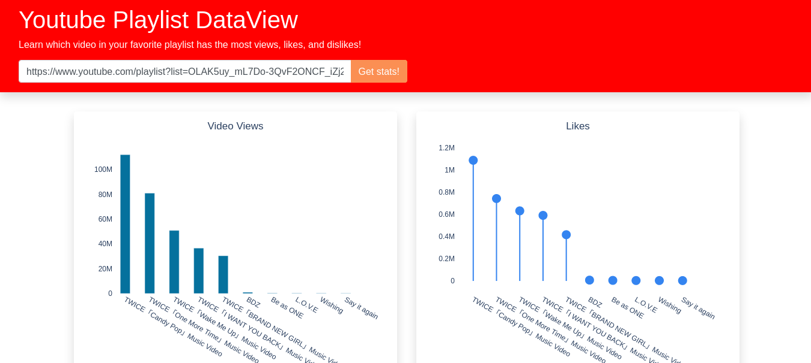
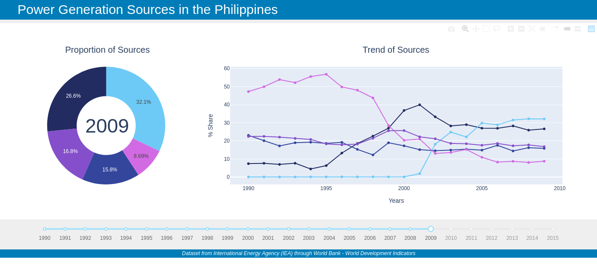

*The dataset, mostly from Makeover Monday, of visualizations presented here are those dataset which intrigued and fascinated me. Hence, this portfolio exists.*

Contact me for projects, comments, reactions, and suggestions: **nvqa.business@gmail.com**

###### The wine on your table. (Part 2)

Created using matplotlib.

###### Suspicious coworker...

First attempt in making an infographic. Created using visme.

###### Date night with Mekko Charts

Tried something unconventional. Created using plotly.

###### Give space for food!

Dataset about food is really fun. Created using plotly.

###### The wine on your table.

Quick viz using plotly (purely).

###### Apple's Supremacy

Inspired by the viz of *@hoskerdu* from Makeover Monday. Created using matplotlib.

###### Economic Freedom of the World (SEA Edition!)

Created using plotly.

###### Japanese ONCE on fire!

Created using plotly.

###### Are you a Millennial?

Created using plotly.

###### 175 hours of Sunshine

Created using plotly.

###### Sunshiniest in Asia?

Inspired by the viz of *David Wakelin* from Makeover Monday. Created using plotly.

###### American Fast Food

Created using plotly.

###### Gasoline vs Diesel

Created using plotly.

###### View Youtube playlist data [(Interactive!)](https://yt-data-view.herokuapp.com/)

Might be useful someday??? Created using Dash.

###### Corruption Perceptions Index

Created using plotly.

###### Power Generation Sources [(Interactive!)](https://phl-power-gen.herokuapp.com/)

A Dash implementation.

###### Southeast Asia CO2 emissions

Created using matplotlib.

###### Philippine Power Plants

Created using plotly.

###### Health Stations & Immunization

Created using matplotlib.

###### Commodity Prices [(Interactive!)](https://phl-retail-commodity.herokuapp.com/)

A Dash implementation.

###### Health Expenditure & Life Expectancy

Created using plotly.

