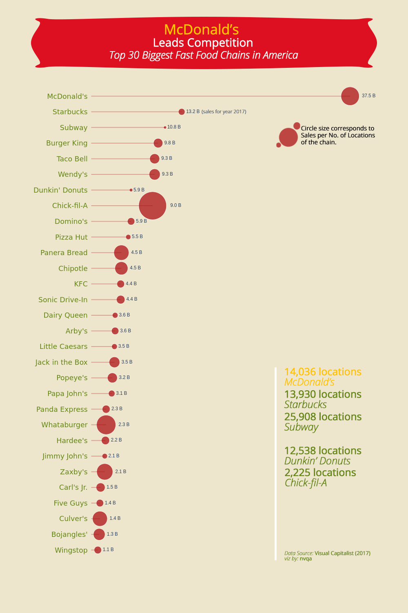
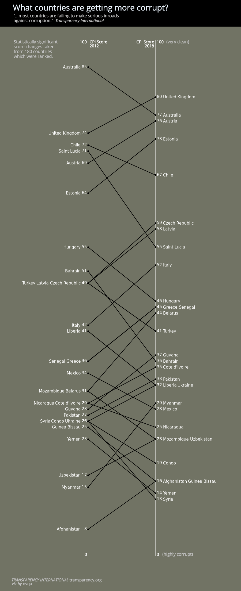

###### Economic Freedom of the World

###### Japanese ONCE on fire!

###### Are you a Millennial?

###### 175 hours of Sunshine

###### Sunshiniest in Asia?

Inspired by the viz of David Wakelin from Makeover Monday.

###### American Fast Food

###### Gasoline vs Diesel

###### View Youtube playlist data [(Interactive!)](https://yt-data-view.herokuapp.com/)

Might be useful someday???

###### Corruption Perceptions Index

###### Power Generation Sources [(Interactive!)](https://phl-power-gen.herokuapp.com/)

Another Dash implementation.

###### Southeast Asia CO2 emissions

###### Philippine Power Plants

###### Health Stations & Immunization

###### Commodity Prices [(Interactive!)](https://phl-retail-commodity.herokuapp.com/)

A Dash implementation.

###### Health Expenditure & Life Expectancy

