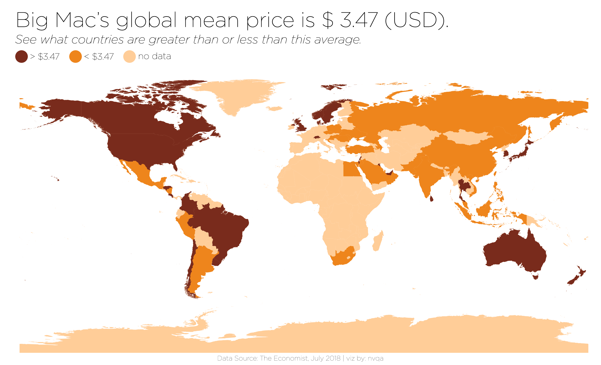
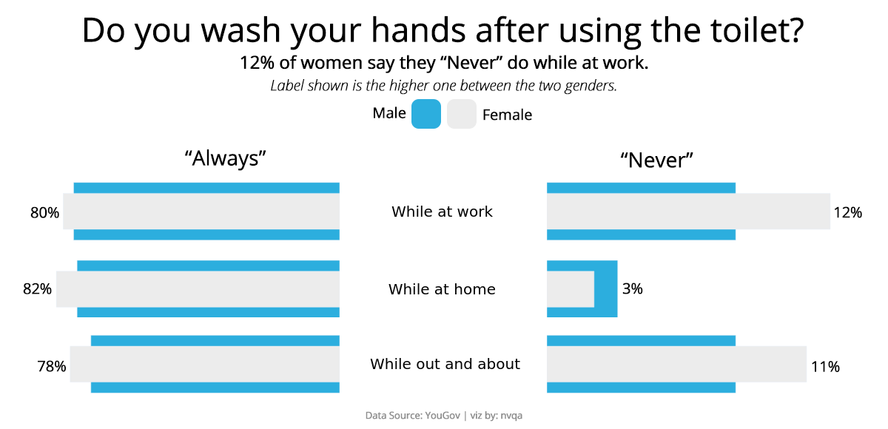
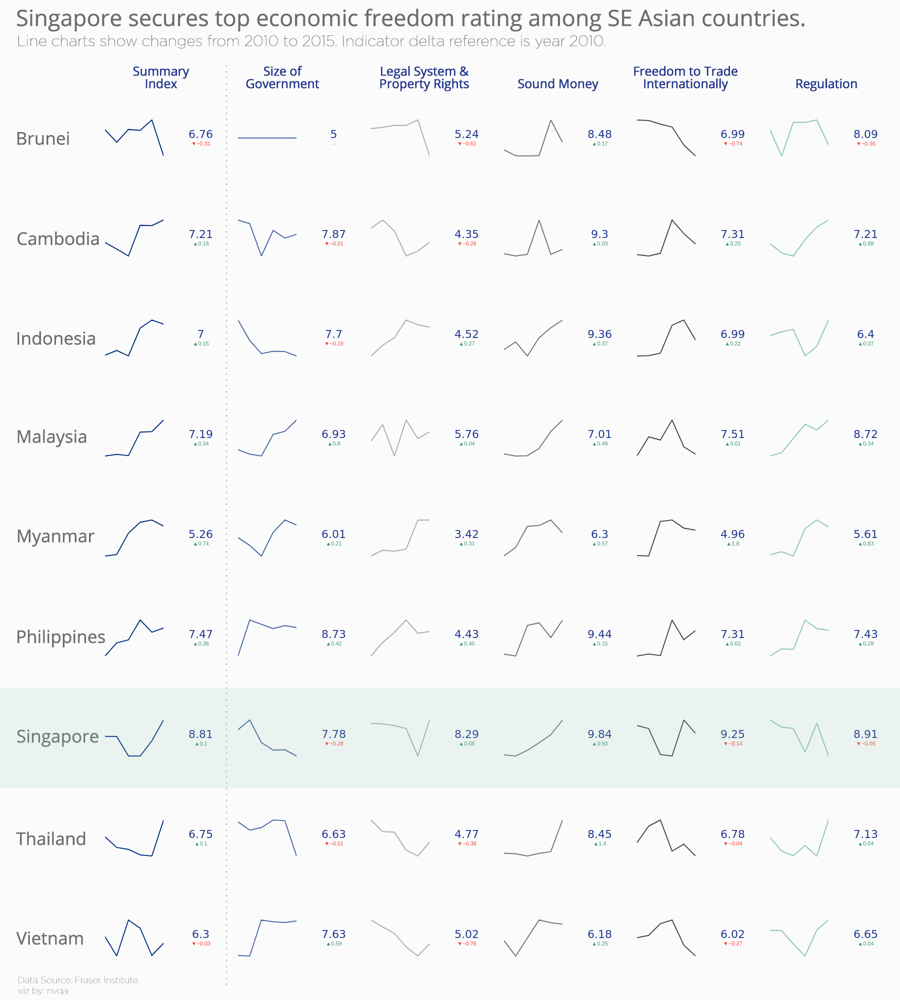
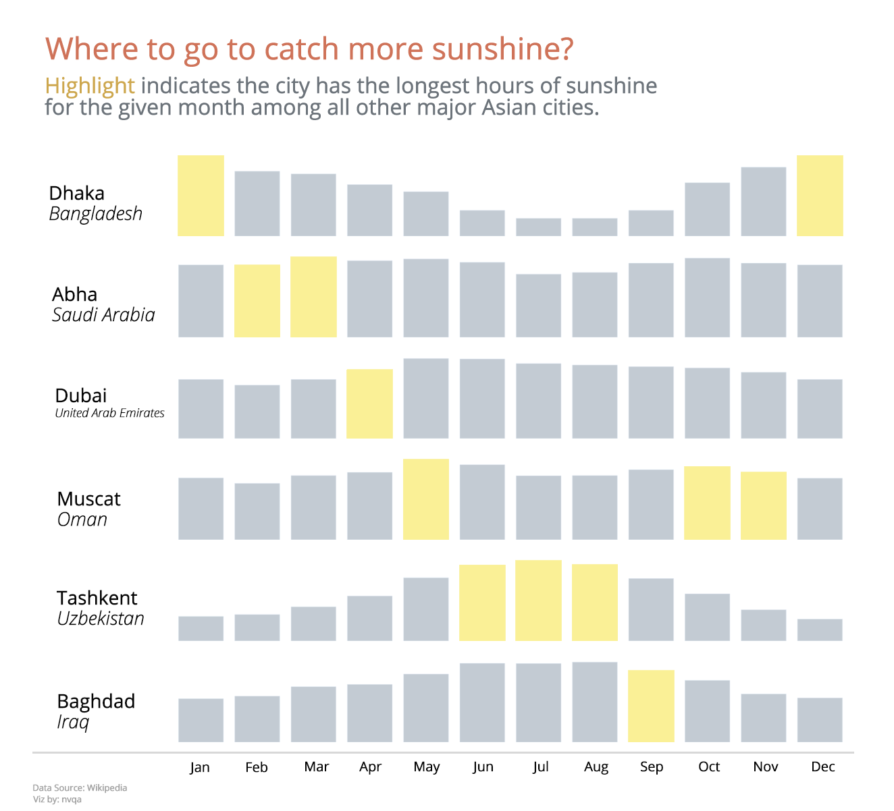
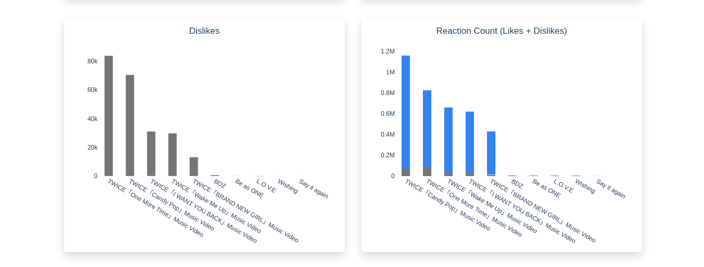
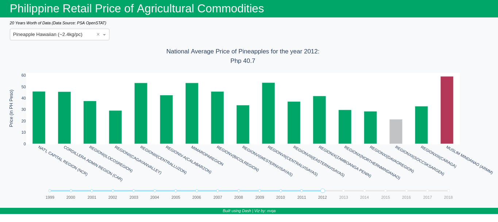

*The dataset, mostly from Makeover Monday, of visualizations presented here are those dataset which intrigued and fascinated me. Hence, this portfolio exists.*

Contact me for projects, comments, reactions, and suggestions: **nvqa.business@gmail.com**

## Planes vs Trains

Created using chartify.

## Big Mac Index (Part 2)

Created using matplotlib.

## Suspicious coworker...

Something that's weird but helpful. Created using plotly.

## The wine on your table. (Part 2)

Revisited the dataset to create a map. Created using matplotlib.

## Date night with Mekko Charts

Tried something unconventional. Created using plotly.

## Give space for food!

Dataset about food is really fun. Created using plotly.

## The wine on your table.

Quick viz using purely plotly.

## Apple's Supremacy

Inspired by the viz of *@hoskerdu* from Makeover Monday. Created using matplotlib.

## Economic Freedom of the World (SEA Edition!)

Tried a 'Regional' version of the dataset. Created using plotly.

## Japanese ONCE on fire!

Countries are selected based on where most of the foreign kpop idols came from. Resorted to Macao and Hong Kong in place of China due to the Great Firewall. Philippines is included since I live there (Haha!). Created using plotly.

## Are you a Millennial?

Based on Pew Research Center, Millenials are born from 1981 to 1996. Created using plotly.

## 175 hours of Sunshine

I live in the Philippines. That explains why it's first in the order. Hehe. And why I decided to plot relative to 175 hours. Created using plotly.

## Sunshiniest in Asia?

Inspired by the viz of *David Wakelin* from Makeover Monday. Created using plotly.

## American Fast Food

Jollibee pa rin! Haha. Created using plotly.

## Gasoline vs Diesel

Only a handful of countries does diesel price is higher than gasoline. Created using plotly.

## View Youtube playlist data [(Interactive!)](https://yt-data-view.herokuapp.com/)

Might be useful someday??? Created using Dash.

## Corruption Perceptions Index

Undoubtedly, in this world, corruption is vital to stay in power. Created using plotly.

## Power Generation Sources [(Interactive!)](https://phl-power-gen.herokuapp.com/)

A Dash implementation. Hmmm...What if I present this to my former ME professors?

## Southeast Asia CO2 emissions

Riding the bar chart race trend. Created using matplotlib.

## Philippine Power Plants

Now something related with Mechanical Eng'g. Created using plotly.

## Health Stations & Immunization

Created using matplotlib.

## Commodity Prices [(Interactive!)](https://phl-retail-commodity.herokuapp.com/)

My first Dash app.

## Health Expenditure & Life Expectancy

Created using plotly.

## Big Mac Index

My first time using chartify (developed by Spotify! wow) for visualizations. Chartify consumes tidy data, and is really helpful in making quick charts.

