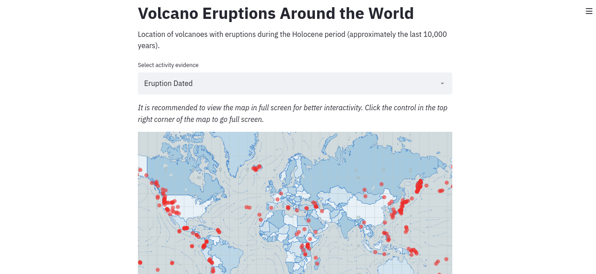
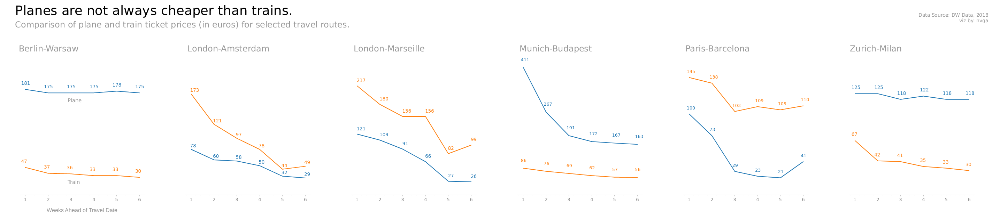
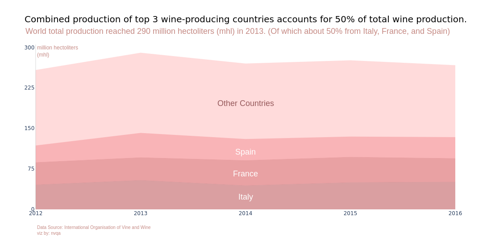
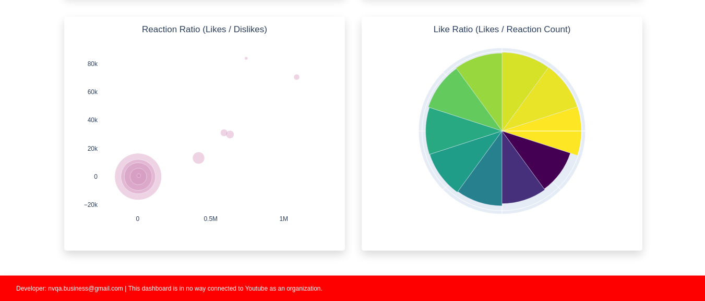
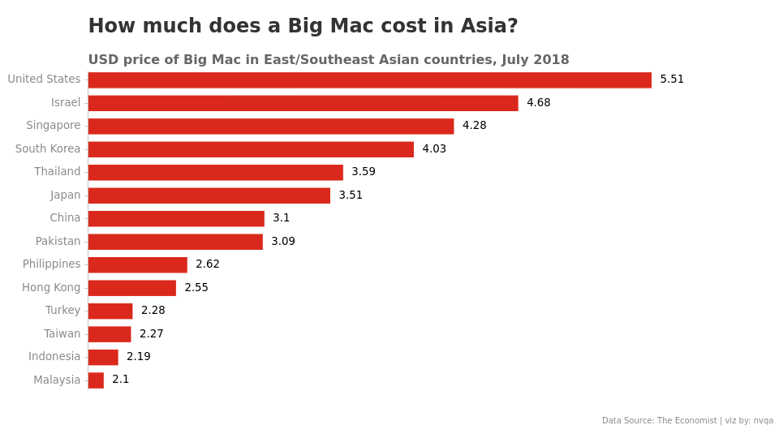

*The dataset, mostly from Makeover Monday, of visualizations presented here are dataset which intrigued and fascinated me.*

Contact me for projects, comments, reactions, and suggestions: **nvqa.business@gmail.com**

## Another major event early this year. [(Interactive!)](https://wuhan-ncov.herokuapp.com/)

I'm actually updating this manually. No available free API to fetch some realtime data yet. [Click me! I'll take you to the web app.](https://wuhan-ncov.herokuapp.com/)

## Choropleth collection [(Interactive!)](https://phl-choropleth.herokuapp.com/)

Finally conquered plotly mapbox choropleths! [Click me! I'll take you to the web app.](https://phl-choropleth.herokuapp.com/)

## When was the last time your favorite volcano erupted? [(Interactive!)](https://volcano-erupts.herokuapp.com/)

*Pacific Ring of Fire* is no joke. [Click me! I'll take you to the web app.](https://volcano-erupts.herokuapp.com/) Built with Streamlit.

## Looks vs Personality (Part 3) [(Interactive!)](https://partner-survey.herokuapp.com/)

Created an interactive version of the viz. [Click me! I'll take you to the web app.](https://partner-survey.herokuapp.com/) Built with Streamlit.

## How does your sport compare?

Created using chartify.

Here is an animated version.

## Looks vs Personality (Part 2)

The WOMEN version. Created using plotly.

## Looks vs Personality

Inspired by the viz of *@evamurray* from Makeover Monday. Created using plotly.

## Food availability in the Philippines

Created using plotly.

## Population cartogram

Finally made a decent cartogram! Cartogram generated using flow-based algorithm (Gastner, M., Seguy, V., & More, P. (2018). Fast flow-based algorithm for creating density-equalizing map projections. Proceedings of the National Academy of Sciences USA, 115:E2156-E2164)

Below is a GIF version of the viz.

## Planes vs Trains

Created using chartify.

## Big Mac Index (Part 2)

Created using matplotlib.

## Suspicious coworker...

Something that's weird but helpful. Created using plotly.

## The wine on your table. (Part 2)

Revisited the dataset to create a map. Created using matplotlib.

## Date night with Mekko Charts

Tried something unconventional. Created using plotly.

## Give space for food!

Dataset about food is really fun. Created using plotly.

## The wine on your table.

Quick viz using purely plotly.

## Apple's Supremacy

Inspired by the viz of *@hoskerdu* from Makeover Monday. Created using matplotlib.

## Economic Freedom of the World (SEA Edition!)

Tried a 'Regional' version of the dataset. Created using plotly.

## Japanese ONCE on fire!

Countries are selected based on where most of the foreign kpop idols came from. Resorted to Macao and Hong Kong in place of China due to the Great Firewall. Philippines is included since I live there (Haha!). Created using plotly.

## Are you a Millennial?

Based on Pew Research Center, Millenials are born from 1981 to 1996. Created using plotly.

## 175 hours of Sunshine

I live in the Philippines. That explains why it's first in the order. Hehe. And why I decided to plot relative to 175 hours. Created using plotly.

## Sunshiniest in Asia?

Inspired by the viz of *David Wakelin* from Makeover Monday. Created using plotly.

## American Fast Food

Jollibee pa rin! Haha. Created using plotly.

## Gasoline vs Diesel

Only a handful of countries does diesel price is higher than gasoline. Created using plotly.

## View Youtube playlist data [(Interactive!)](https://yt-data-view.herokuapp.com/)

Try using this with your favorite YT playlist! [Click me! I'll take you to the web app.](https://yt-data-view.herokuapp.com/)  Created using Dash.

## Corruption Perceptions Index

Undoubtedly, in this world, corruption is vital to stay in power. Created using plotly.

## Power Generation Sources [(Interactive!)](https://phl-power-gen.herokuapp.com/)

A Dash implementation. [Click me! I'll take you to the web app.](https://phl-power-gen.herokuapp.com/) 

## Southeast Asia CO2 emissions

Riding the bar chart race trend. Created using matplotlib.

## Philippine Power Plants

Now something related with Mechanical Eng'g. Created using plotly.

## Health Stations & Immunization

Created using matplotlib.

## Commodity Prices [(Interactive!)](https://phl-retail-commodity.herokuapp.com/)

My first Dash app. [Click me! I'll take you to the web app.](https://phl-retail-commodity.herokuapp.com/) 

## Health Expenditure & Life Expectancy

Created using plotly.

## Big Mac Index

My first time using chartify (developed by Spotify! wow) for visualizations.

